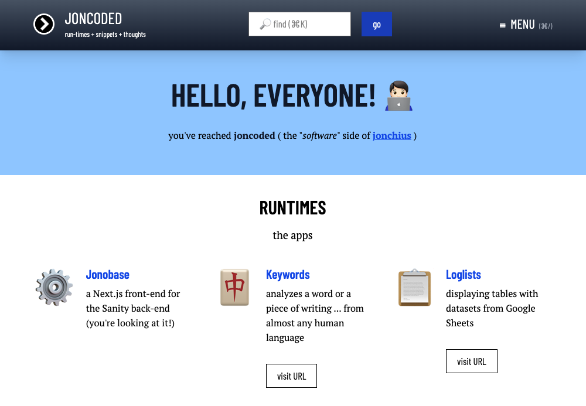
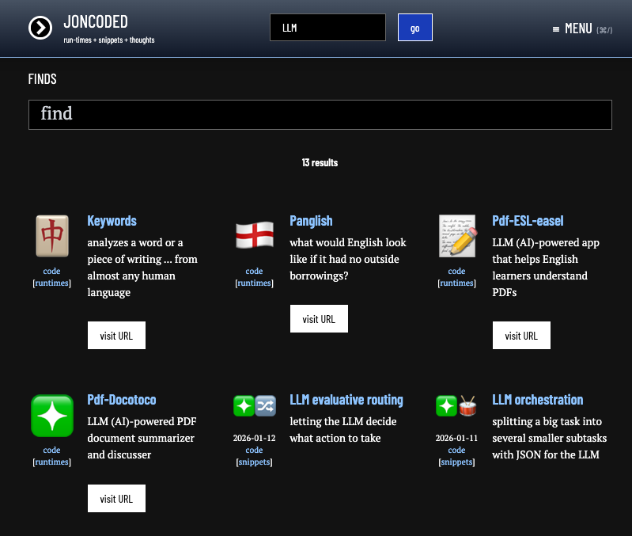

# Jonobase

jamming up the blogging world with a web framework



## Forewords

WordPress (that "infamous blogging platform") did its job well into the late 2000s and early 2010s, having a straightforward "developer experience". However, things slowly "enshittified" when WordPress "developers" made things more tangled-up than necessary!

So, I spent too much time looking for a new "content management system" (perhaps years). In 2020, I settled on Sanity (an apt name!) for a headless (no front-end) path. I wanted someone to take care of the back-end (all the "data storage") in a straightforward way. Meanwhile, I could build a front-end on my own. Also, I wanted to start with something small (a list of entries and a page for each individual entry), but build up into whatever I could think of!

## Runtimes

Thus, I ended up with a website ("blogging and portfolio") framework made with a Next.js front-end and a Sanity (headless "CMS") back-end:

<a href="https://www.joncoded.com" target="_blank"><button>joncoded.com</button></a>

and

<a href="https://www.jonchius.com" target="_blank"><button>jonchius.com</button></a>

## Hallmarks

A boat-load of stuff comes with this:

*   **"accessible hotkeys"**
    
    *   command+K for "search""
        
    *   command+/ for "menu"
        
*   **light-to-dark "theme toggle"**


    
*   **fully working search** (known as "**finds**")
    
*   **full-screen "menu"**
    
*   **home page** with full-width "sections" (known as "**lists**")
    
    *   having only words
        
    *   ...or a list of posts lined up by "date" or "title" or "randomly"
        
    *   words can show up before and/or after the list
        
*   **"summary" pages** with stacked lists (known as "**heaps**")
    
    *   great for lining up stuff in many ways!
        
*   **heading-based "table of contents"**
    
    *   both for "desktop" and "mobile"
  

        
*   **"category post routing"** 
    
    *   clean URLs like `/code/snippets/post-page`
        
*   **"post tagging system"** (known as "**nooks**")
    
*   **"embeddable content"**
    
    *   YouTube videos
        
    *   Google maps
        
    *   code snippets (that you can copy-and-paste with a click!)
        
    *   tables
        
*   **"follow-up link"** 
    *   show a link to an outside URL (or hide it!)
    
*   **"older-and-newer post navigation"**
    *   show the last or the next
    
*   **footer** 
    *   tweakable from the back-end with "rich text editor"
    
*   **responsive** 
    *   in desktop and mobile
    
*   **multi-site** 
    *   (more on this later!)
  
Making note of:

* front-end frameworks:
  * `next.js`
* third-party packages:
  * `focus-trap-react`
  * `next-themes`
  * `react-hotkeys-hook`
  * `react-syntax-highlighter`
* back-end framework (CMS):
  * `sanity`

...[full list of packages](./package.json)!

## Setup

This needs:

* Node.js and npm
* Sanity (CMS) account and API key

### clone repo

```
% git clone https://github.com/joncoded/jonobase.git yourfolder
% cd yourfolder
```

Then, make a `.env` file with the following:

```
SANITY_STUDIO_PROJECT_ID="your_project_id"
SANITY_STUDIO_TOKEN="your_api_key"
SANITY_STUDIO_BASE_SLUG="your_base_slug"
```

You will first have to make a "base" (i.e. a website object) in "Sanity Studio" (the CMS admin panel)  to get this slug! 

### run it!

```
npm run dev
```